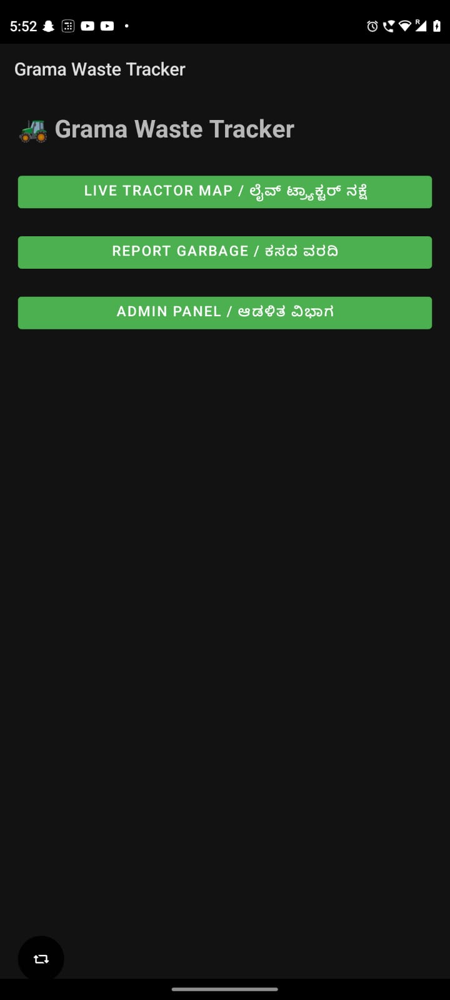
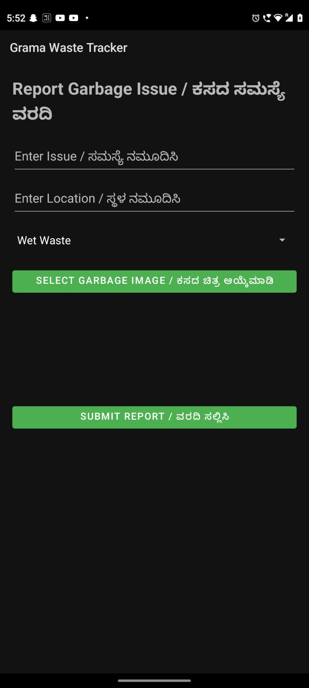
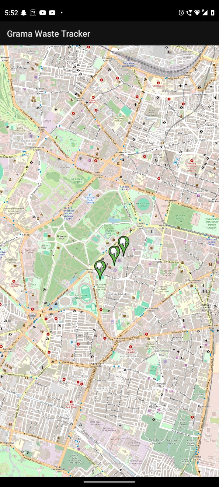

# Grama Waste Tracker 🚜♻️

## Smart Rural Waste Management Android Application

Grama Waste Tracker is an Android application developed to improve rural waste collection and monitoring systems. The app helps citizens track garbage collection vehicles in real time, report garbage blackspots, and enables administrators to monitor and manage waste complaints efficiently.

---

# 📱 Features

## 🚜 Live Tractor Tracking

* Real-time moving waste collection vehicle simulation
* Smooth tractor movement on map
* Distance indicator from user location
* Route tracking using OpenStreetMap (OSMDroid)

---

## 🚨 Garbage Blackspot Reporting

* Citizens can report garbage issues
* Select waste category
* Add garbage image
* Add location details
* Complaint submission system

---

## 🗺 Admin Monitoring Panel

* Dedicated admin map
* View reported garbage blackspots
* Monitor waste collection areas
* Remove blackspots after cleaning

---

## 🌐 Bilingual Support

* English UI
* Kannada UI support

---

## 🔥 Firebase Integration

* Firebase Realtime Database support
* Store complaints
* Store blackspot reports
* Sync tractor location data

---

# 🛠 Technologies Used

* Kotlin
* Android Studio
* Firebase Realtime Database
* OpenStreetMap (OSMDroid)
* XML Layout Design

---

# 📂 Project Structure

```text id="jlwm7w"
app/
 ├── java/com/example/gramawastetracker
 │    ├── MainActivity.kt
 │    ├── MapActivity.kt
 │    ├── ReportActivity.kt
 │    ├── AdminActivity.kt
 │    ├── AdminMapActivity.kt
 │    └── SharedData.kt
 │
 ├── res/
 │    ├── layout/
 │    ├── drawable/
 │    ├── values/
 │    └── mipmap/
```

# 🚀 How to Run the Project

## 1️⃣ Clone Repository

```bash id="jlwm1m"
git clone <repository-link>
```

---

## 2️⃣ Open in Android Studio

* Open Android Studio
* Click "Open Existing Project"
* Select project folder

---

## 3️⃣ Firebase Setup

* Create Firebase project
* Enable Realtime Database
* Download `google-services.json`
* Place it inside:

```text id="jlwm2r"
app/google-services.json
```

---

## 4️⃣ Sync Gradle

Click:

```text id="jlwm8c"
Sync Now
```

---

## 5️⃣ Run App

Connect Android device or emulator and click:

```text id="jlwm0x"
Run ▶
```

---

# 📸 Screens Included### 
🏠 Home Screen 
 
--- ### 

🚜 Live Tractor Tracking
 
--- ### 


🚨 Garbage Report Page
 
--- ### 


🗺 Admin Panel 



---

# 🎯 Future Improvements

* Real GPS-based tracking
* Push notifications
* AI waste detection
* Route optimization
* User authentication
* Cloud image storage
* Kannada voice support

---

# 👩‍💻 Developed By

Raveena Kumari

Bachelor of Engineering – Computer Science

---


